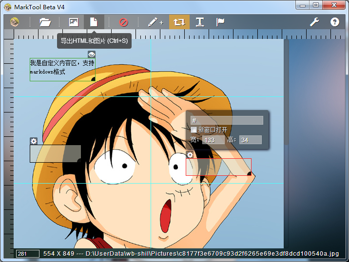

MarkTool - 营销活动工具
========




## 具备的功能：

- 导入
	* 支持 jpg, jpeg, png, gif等图片类型
    * 支持拖拽导入
- 标尺
- 参考线
	* 可拖拽
    * 可上下左右按键微调
    * 单条删除 || 批量清空
    * 一键设置黄金分割线
- 导出
	* 导出图像or导出图像和HTML，可选
    * 导出成功后，可在浏览器预览，支持一键复制源代码
    * 自定义导出模板
- 用户足迹
	* 记住最后一次的保存路径 and 选择路径
    * 记住用户最后一次设置的切线列表
- 画热区
    * 可上下左右按键微调坐标，配合shift键使用微调宽高
    * 可设置热区链接，是否新窗口打开，标题等
- 用户设置
	* 模板编辑
    * 保存路径设置
    * more... ...

## Feasures
- 标尺刻度
- 导出图片质量可设置
- 生成图片展示形式可选，背景或者img标签
- 新建自定义模板
- 历史记录（撤销、重做）
- 简单的图片处理
- 多标签？
- 图片合成？

## 下载
最新版本：Beta V3

* Windows 32bit: [云盘下载](http://yunpan.cn/QGYhegYNxVta7)

PS：以上32位版本，在64位系统上测试通过是可以使用的，不过不排除某些情况下失效，原因未知。

## 安装步骤

### windows
首先你必须安装图片处理库 `GraphicsMagick` ，下载地址 ftp://ftp.graphicsmagick.org/pub/GraphicsMagick/windows/ 注意它有32位和64位的版本，请选择与系统对应的版本下载。

安装完成打开CMD命令，运行：
```
gm version
```

`大多数情况` 会正确执行并返回，如果没有正确执行，可以尝试 `重启电脑` ，再次运行以上命令

命令执行成功后，按照上面给出的地址下载 MarkTool，解压

OK，现在可以运行MarkTool.exe啦！

## 特别感谢
- Node-Webkit：[https://github.com/rogerwang/node-webkit/](https://github.com/rogerwang/node-webkit/)
- GraphicsMagick for node: [http://aheckmann.github.com/gm/](http://aheckmann.github.com/gm/)

# License
本项目基于MIT协议发布

MIT: [http://rem.mit-license.org](http://rem.mit-license.org/) 详见 [LICENSE](/LICENSE) 文件
