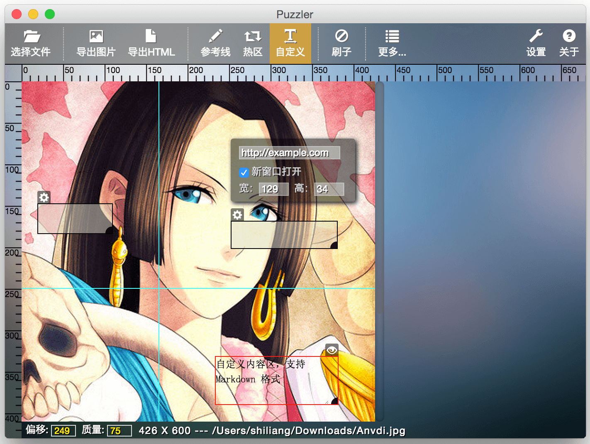

Puzzler
==============

> Puzzler 是一个高效快速的前端页面切图工具，用于将一张图片快速切割成切片并导出 HTML 文件，
所有的工作都通过可视化拖拽完成，让你从重复的 PSD 切图工作中解放出来。Puzzler 的愿景是拯救 ♥ 切图仔！

[EN](/README-EN.md)

[帮助文档及常见问题](docs/HELP.md)

## 下载地址

最新版本: **v0.8.4** [changeLog](docs/CHANGELOG.md)

- Mac OS X: [32bit](http://pan.baidu.com/s/1jGDA2yU) / [64bit](http://pan.baidu.com/s/1c0ju7de)
- Windows: [32bit](http://pan.baidu.com/s/1c0sNYQs) / [64bit](http://pan.baidu.com/s/1bnHS2B1)

> 下载即可运行，不需要安装任何依赖环境。目前提供了 Mac 和 Windows 两个平台的客户端，如果需要在 Linux 系统上使用此工具，欢迎联系我，我将乐于在 Linux 系统上测试提供帮助。

## 主要功能特性

- 支持拖拽导入图片，支持 jpg, png 等图片类型
- 灵活的标尺和参考线操作，支持快速地移动拖放
- 支持导出图像切片和 HTML 文件，导出之前还支持图像质量设置，自定义导出模板
- 导出成功后可以一键预览、一键复制源代码
- 操作记录自动恢复，以前切割过的图片可沿用历史记录继续操作
- 支持创建图片热区，快速地拖放操作，并可设置热区的链接、是否新窗口打开和宽高信息
- 全面地快捷键支持
- 便利地用户设置，支持多种常用设置
- 可创建自定义文字内容，文字内容支持 Markdown 格式

---

# 使用帮助

### 参考线的操作方式

- 按住顶部标尺不放，往下拖拽新增 X 轴参考线，按住左侧标尺拖拽新增 Y 轴参考线
- 点击参考线，参考线颜色变为红色，表示当前参考线是选中状态，左下角的「偏移」输入框会显示参考线的偏移量
- 可以直接拖拽参考线改变偏移量
- 选中参考线后，可以通过上、下、左、右按键进行偏移量的微调，也可以在「偏移」处输入具体的偏移量，按回车生效
- 选中参考线后，可以按「Delete」键删除参考线，或通过鼠标右键在弹出的菜单项删除
- 按住鼠标左键往左方向把参考线拖拽出图片区域再松开鼠标，可以快速删除 Y 轴参考线，往上则可以快速删除 X 轴参考线

### 导出文件

- 点击「导出切片」仅导出图像切片
- 点击「导出HTML」导出图像切片和 HTML
- 导出之前可在左下角「质量」输入框设置导出图像的质量，默认 75
- 导出成功后可以一键预览、一键复制源代码
- 可以在「设置」中修改导出的 HTML 模板

### 热区的操作方式

- 点击工具栏的「热区」进入预备状态，鼠标移到工作区后，手势会变为十字架，按住鼠标左键并移动即可创建一个热区，再次点击工具栏的「热区」，可取消预备状态
- 点击创建好的热区，边框颜色变为红色，表示当前热区是选中状态
- 可以直接拖拽热区改变位置
- 选中热区后，可以通过上、下、左、右按键进行位置的微调，同时按住 shift 键，则可以进行宽度和高度的微调
- 鼠标移至热区右下角黑色方块并拖拽，可改变宽度和高度
- 热区左上角的设置按钮，可以设置热区的链接地址、是否新窗口打开等信息，并可通过输入框快速指定热区的宽度和高度

### 支持的快捷键

- `Ctrl + N` 选择文件
- `Ctrl + S` 导出 HTML 和图片切片
- `Ctrl + Shift + S` 仅导出图片切片
- `Ctrl + E` 参考线
- `Ctrl + R` 激活热区
- `Ctrl + T` 激活自定义内容区
- `Ctrl + D` 刷子

### 用户设置的导出与导入

点击工具栏的「更多」，通过下拉菜单中的「导出用户设置」可以将当前用户的「设置」导出成配置文件，配置文件可以通过下拉菜单中的「导入用户设置」来导入。

### 导出的 HTML 模板
- 目前有「宽度 < 990」、「宽度 > 990」、「宽度 > 990（挖空）」三种
- 导入图片后，会根据图片尺寸自动判断应用何种模板，也可以手动指定
- 可以在「设置」中恢复模板的出厂设置

---

# 常见问题

### Puzzler 适合切什么类型的页面？

营销活动类和纯展示类的页面，这种页面一般只有图片和链接，没有动态数据，非常适合快速自动化切割。

### 如何固定导出文件的位置？

「设置」-「高级」-「保存路径」，指定导出位置。

### 导出时会有哪些文件？文件结构是怎么样的？

仅导出图像切片时，只会包含切片文件：

    ├── section-1.jpg
    ├── section-2.jpg
    └── section-3.jpg

同时导出 HTML 和图像切片时，包含以下文件：

    ├── config.json
    ├── images
    │   ├── section-1.jpg
    │   ├── section-2.jpg
    │   └── section-3.jpg
    ├── index.html
    └── origin.jpg

- `config.json` 文件是操作记录，包括参考线、热区、自定义内容等信息。
- `origin.jpg` 是原始图片文件。
- `images` 文件夹包含导出的图像切片。
- `index.html` 是导出的 HTML 文件。

### 以前切过这张图片，我能沿用以前的参考线、热区记录继续操作吗？

完全可以。导出 HTML 时，会同时生成一个 `config.json` 的配置文件，用户选择图片时，系统会检查该图片同级目录里是否存在 `config.json` 文件并恢复操作记录。导入图片时进入以前导出的文件夹选择 `origin.jpg` 文件即可。

### 黄金分割是什么？如何自定义？

黄金分割可以快速界定中间主区域，主要针对尺寸很大的图片（宽度大于 990 像素），通过「参考线」-「黄金分割」-「自定义」可以自定义。

### 如何快速选择最后一次的参考线记录？

点击工具栏的「参考线」，通过下拉菜单的「拉取上一次的记录」可以做到。

### 标尺的刻度能不能改？

可以，标尺的步长支持 50 和 100 两种刻度，默认 50，可在「设置」-「常用」-「标尺」中更改。

### 刷子是什么？

用于清空参考线、热区、自定义内容区等操作记录。

### 如何取消导出时根据图片名称创建的文件夹？

「设置」-「常用」-「导出选项」，选择「在选中文件夹里放置导出文件」。

### 自定义内容区是什么？

自定义内容区操作方式与热区相似，可以输入一些文字，支持 Markdown 格式，点击右上角眼睛图标可以预览。

### 如何查看自定义内容区解析后的源代码？

鼠标右键，通过弹出的的「查看源代码」菜单项查看。

---

☞ [发现 Bug, 我要吐槽！](https://github.com/superRaytin/puzzler/issues/new) ☞ [♥ 提建议 ♥](https://github.com/superRaytin/puzzler/issues/new)

> 我坚信，一旦你尝到自动化切图的甜头，你就会爱上它。

# License
本项目基于 MIT 协议发布

MIT: [http://rem.mit-license.org](http://rem.mit-license.org/), 详见 [LICENSE](/LICENSE) 文件
