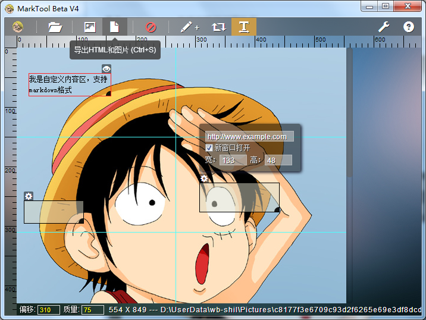

MarkTool
==============



## 具备的功能：

- 导入
	* 支持 jpg, jpeg, png等图片类型
    * 支持拖拽导入
- 标尺
- 参考线
	* 可拖拽
    * 可上下左右按键微调
    * 单条删除 || 批量清空
- 导出
	* 导出图像or导出图像和HTML，可选
    * 导出成功后，可在浏览器预览，支持一键复制源代码
    * 自定义导出模板
    * 导出图像质量可设置
- 用户足迹
	* 记住最后一次的保存路径 and 选择路径
    * 记住用户最后一次设置的切线列表
- 画热区
    * 可上下左右按键微调坐标，配合shift键使用微调宽高
    * 可设置热区链接，是否新窗口打开，标题等
- 自定义内容区
    * 支持markdown格式内容解析
- 用户设置
	* 模板编辑
    * 保存路径设置
    * 标尺设置
    * more... ...

## Features
- 生成图片展示形式可选，背景或者img标签
- 新建自定义模板
- 历史记录（撤销、重做）
- 简单的图片处理
- 多标签？
- 图片合成？
- 自动更新

## 下载
### 最新版本
Beta V5 (0.3.1) [changeLog](#changelog)

* Windows 32bit: [云盘下载](http://yunpan.cn/Q9TJgbHLGzPcL)

### 以往版本

* Beta V4 (0.3.0) for Win32: [云盘下载](http://yunpan.cn/QbRQ2IjcZmxSQ)
* Beta V3 (0.1.3) for Win32: [云盘下载](http://yunpan.cn/QGYhegYNxVta7)

PS：以上32位版本，在64位系统上测试通过是可以使用的，不过不排除某些情况下失效，原因未知。

## 安装步骤

### windows
首先你必须安装图片处理库`GraphicsMagick`，下载地址 ftp://ftp.graphicsmagick.org/pub/GraphicsMagick/windows/ 注意它有32位和64位的版本，请选择与系统对应的版本下载。

安装完成打开CMD命令，运行：
```
gm version
```

`大多数情况`会正确执行并返回，如果没有正确执行，可以尝试`重启电脑`，再次运行以上命令

命令执行成功后，运行MarkTool.exe

## 特别感谢
- Node-Webkit：[https://github.com/rogerwang/node-webkit/](https://github.com/rogerwang/node-webkit/)
- GraphicsMagick for node: [http://aheckmann.github.com/gm/](http://aheckmann.github.com/gm/)

##ChangeLog
### 0.3.1 (2013.11.15)
- 【增加】导出图片质量设置（压缩范围0~100，只支持JPG/JPEG格式图片，因为PNG压缩一直是无损的）；
- 【增加】标尺刻度值，标尺设置项；

### 0.3.0 (2013.10.11)
- 增加自定义内容区功能；
- 导出HTML的情况，同时导出配置文件和初始图片文件；
- 切线记录更改为实时保存，去掉【立即保存当前记录】功能；
- 增加常用功能菜单 —— 点击菜单栏第一项MarkTool的logo即可显示；
- 增加【导出选项】设置；
- 重构【拉取最后的切线记录】功能，解决切线ID撞车的可能；
- 增加快捷键支持；
- 增加不影响操作的右下角提示功能；
- 突出显示热区信息设置；

### 0.1.3 (2013.09.16)
- 模板增加【宽度 > 990(挖空)】一项，可导出背景图；

# License
本项目基于MIT协议发布

MIT: [http://rem.mit-license.org](http://rem.mit-license.org/) 详见 [LICENSE](/LICENSE) 文件
